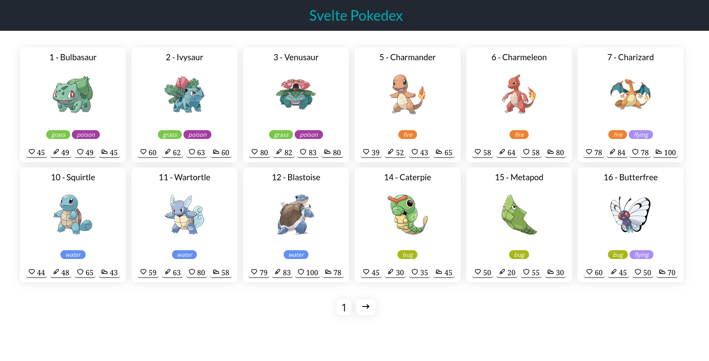

# Pokedex
Uma pokedex feita com svelte e [PokeApi](https://pokeapi.co/). estilizada com SASS. 




#### Tecnologias
---
- [svelte](https://svelte.dev/)
- [axios](https://axios-http.com/)
- [sass](https://sass-lang.com/)
- [pokeapi](https://pokeapi.co/)


#### Configuração do projeto
---
```bash
# Install dependencies
npm i

# run server
npm run dev

# open url http://localhost:5173
```
